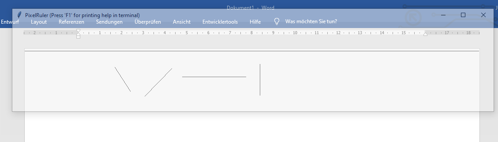
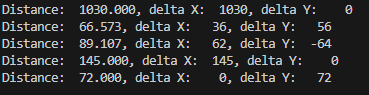
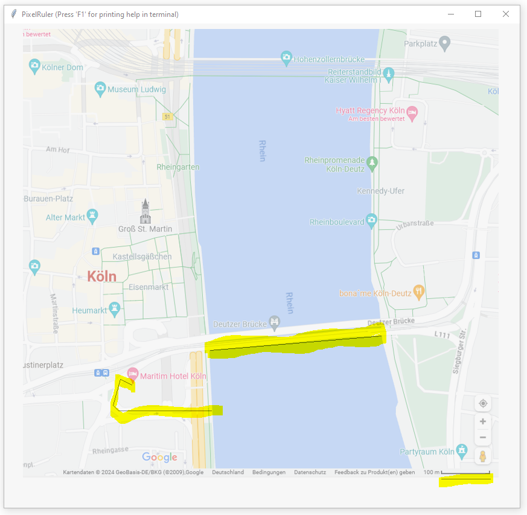
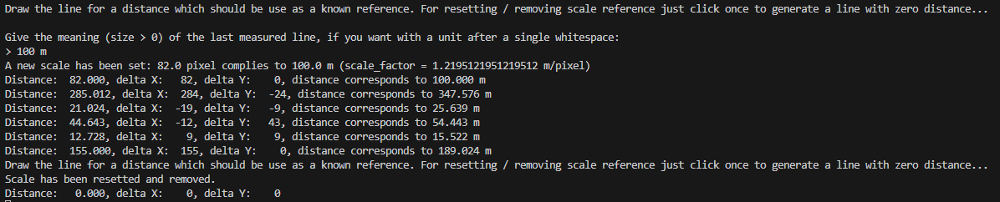
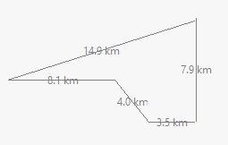

# Pixel Ruler

> Jump to the screenshots in [Usage screenshots](#usage-screenshots) to get an overview without many words.

- [Pixel Ruler](#pixel-ruler)
- [Introduction](#introduction)
- [Usage](#usage)
  - [General Usage](#general-usage)
  - [Additional Functions](#additional-functions)
  - [Usage screenshots](#usage-screenshots)
- [Installation and Prerequisites](#installation-and-prerequisites)
- [Further extension options](#further-extension-options)

# Introduction

A simple pixel ruler written in ('pure') Python, using Tk without further dependencies or third-party-packages.

An exception of this approach is the extending function to capture screenshots of the current window. Herefore is the package `pysimplegui` necessary. If this package is not installed, the script won't break but just print a warning. so the basic functions can still be uaed even without that package.

> This project is based on following repositiy: https://github.com/Kitchi/pixruler.git by Kitchi and has been modified to implement more functions.

# Usage

## General Usage
When executing the script a new window opens. As this window is transparent it can be placed on top of other windows without preventing the visibility of the actual relevant parts on the screen.
Resize this Pixel-Ruler-window to cover the region of interest and drag
your mouse pointer across whatever you want to measure. The length of
the drawned line will be printed on the terminal. 

## Additional Functions

- Create horicontal or vertical lines
  -  Hold the **'Shift'-Key** while drawing to lock one dimension. This allows you to easily create horicontal or vertical lines. 
  -  Which dimension will be locked depends on the current deltaX and deltaY in relation to the starting point: When deltaX is greater than deltaY the Y-coordinate will be locked which allows you to create horicontal lines. Otherwise the X-coordinate will be locked which allows you to create vertical lines.
  

- Use a scale as reference to determine real dimensions
    - Press the **'F5'-Key** for draw a line as a reference scale. After drawing this line prompt the desired 'real' distance for this line into the terminal (e.g. "50"). Optional you can also promt an unit for this value by append this desired unit after a single whitespace (e.g. "50 mm"). For all further measurements this scale-reference will be used to calculate the converted  distance so that additional to the pixel distance this converted distance will be printed to the terminal, too.
  - To update this scale: Press 'F5'-Key again and draw a new line as reference.
  - To reset (remove) this scale: Press 'F5'-Key again and just click on the window.

- Display a label with display of all further drawned lines
  - Press **'L'-Key** to toggle this mode on / off.
  - When this mode is on, a label will be displays the distance of the last drawned line after releasing the mouse button
  - The value is round to 1 decimal digit
  - If a scale-reference has been provided, the label will displays the converted value instead of the value for pixels and the name of the unit will appears as well on the canvas 
    - if no unit was provided, the default string is "user_defined_value". To prevent displaying this long unit, you can provide an own unit and just enter a single space when entering the scale reference.
  

- Undo the last drawing:
  - Press **Strg + Z Keys**  to undo the last drawing and remove it from the canvas
  - *currently only the last line can be removed. Maybe a history of lines will be implemented later, so that this function could be applied more than one times in a row to remove the last n lines.*

- Clear window from all lines
   - Press **'esc'-Key** to delete all lines on the canvas.
   - a set scale reference will not be removed thereby.

## Usage screenshots

**Basic Usage:**

The output in the terminal for these lines is:

**Usage with scale reference:**

The output in the terminal for these (yellow highlighted) lines is:

- So the bridge over the Rhein is about 347.576 m long.
- The following lines have been drawned from Maritim Hotel Köln to the Rhein.

**Usage of labeled lines**

# Installation and Prerequisites

There is no need to install third-party-packages.

To start the script navigate to the folder with the files and run pixruler.

    python pixruler.py

# Further extension options

- [X] Function to clear window from all drawned lines

- [ ] Function to sum (or/and subtract) the distances of multiple lines (e.g. while pressing "+" or "-" key)

- [X] Function to label each line with its distance

- [X] Function to use hotkey [Ctrl] + [Z] to remove only the last drawned line from canvas

